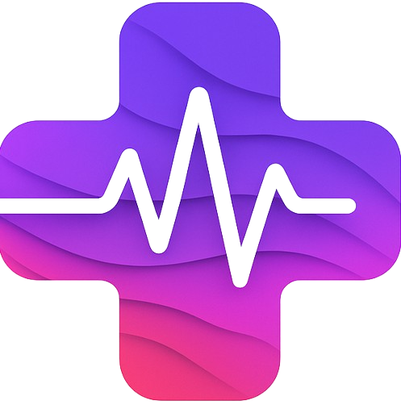

# 🌟 Health Quest

> Turn your wellness journey into a game-like adventure!



A beautifully designed, gamified health and wellness tracking application built with Next.js and TypeScript. Health Quest helps users monitor different aspects of their health with an engaging, retro-modern interface.

## ✨ Features

Health Quest offers multiple wellness trackers, each with unique gamification elements:

- **🌈 Mood Tracker** - Log moods and build your emotional mosaic
- **💧 Hydration Tracker** - Fill your aqua meter and earn hydration streaks
- **😴 Sleep Tracker** - Track sleep patterns and collect Zzz Stars
- **🍎 Nutrition Tracker** - Build your pixel food pyramid with daily logs
- **💪 Fitness Checklist** - Complete workouts and level up your fitness hero
- **⚖️ Weight Tracker** - Visualize progress and earn transformation badges
- **📓 Mental Journal** - Reflect and collect mindful moments
- **🧘‍♂️ Breathing Exercise** - Earn zen points with guided breathing
- **🤸‍♀️ Stretching Routine** - Improve flexibility and mobility

## 📸 Screenshots

<table>
  <tr>
    <td></td>
    <td></td>
  </tr>
  <tr>
    <td></td>
    <td></td>
  </tr>
</table>

## 🚀 Getting Started

### Prerequisites

- Node.js 18.x or higher
- pnpm (recommended) or npm or yarn

### Installation

1. **Clone the repository**

```powershell
git clone https://github.com/your-username/health-tracker-pro.git
cd health-tracker-pro
```

2. **Install dependencies**

```powershell
pnpm install
```

3. **Run the development server**

```powershell
pnpm dev
```

4. **Open your browser**

Navigate to [http://localhost:3000](http://localhost:3000) to see the application in action!

## 🏗️ Project Structure

```
health-tracker-pro/
├── app/                   # Next.js app directory
│   ├── layout.tsx         # Root layout component
│   ├── page.tsx           # Home page
│   └── [tracker]/         # Individual tracker pages
├── components/            # Reusable UI components
│   ├── gamification/      # Gamification elements
│   ├── ui/                # UI components
│   └── widgets/           # Tracker widgets
├── hooks/                 # Custom React hooks
├── lib/                   # Utility functions
├── public/                # Static assets
└── styles/                # Global styles
```

## 🔧 Tech Stack

- **Frontend Framework**: Next.js 14+
- **Language**: TypeScript
- **Styling**: Tailwind CSS
- **State Management**: React Context + Hooks
- **Data Persistence**: Local Storage (with potential for backend integration)
- **UI Components**: Custom components with shadcn/ui

## 🔄 Deployment

### Deploy to Vercel

The easiest way to deploy Health Quest is with [Vercel](https://vercel.com):

1. Push your code to a GitHub repository
2. Import the project in Vercel
3. Vercel will detect Next.js automatically
4. Your site will be deployed!

### Other Deployment Options

```powershell
# Build the application
pnpm build 

# Start the production server
pnpm start
```

## 🧩 Customization

### Adding a New Tracker

1. Create a new file in `components/widgets/` for your tracker component
2. Add a new page in `app/[tracker-name]/page.tsx`
3. Register it in the `Dashboard` component
4. Add it to the feature list in `components/feature-showcase.tsx`

## 🔒 Privacy

Health Quest stores all data locally in your browser. Your health data never leaves your device unless you explicitly configure a backend service.

## 🤝 Contributing

Contributions are welcome! Feel free to submit issues or pull requests.

1. Fork the repository
2. Create a feature branch (`git checkout -b feature/amazing-feature`)
3. Commit your changes (`git commit -m 'Add amazing feature'`)
4. Push to the branch (`git push origin feature/amazing-feature`)
5. Open a Pull Request

## 👏 Acknowledgments

- Pixel art and retro-UI inspiration
- Health tracking best practices
- Gamification principles for wellness
- Open-source community

---

Made with ❤️ for a healthier, more engaging wellness journey.
